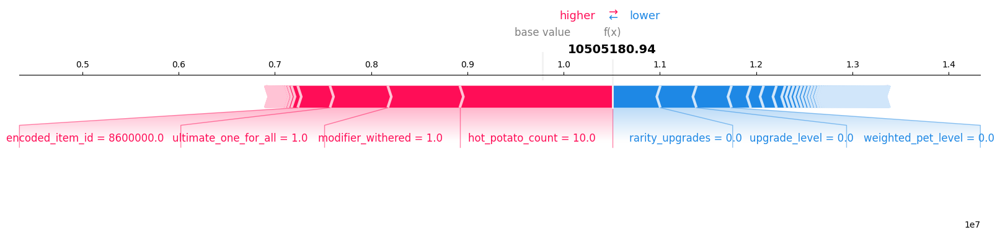

# Hypixel Auction Sniper

## Repository Notice
**This repository serves as a technical showcase of the project's core data engineering pipeline.**

The full source code, including machine learning models and the API, is being developed for a future commercial release. This curated repository demonstrates the complete process of collecting, parsing, transforming, and storing data, which forms the foundation for the ML-driven price prediction engine.

**Included**: The full data pipeline (collection, processing, storage). 
**Omitted**: Key modules responsible for feature engineering, model training, and the prediction API.

---

## Project Overview
The **In-Game Auction Sniper** is an automated trading system designed for the **Hypixel Skyblock** MMORPG economy. It processes real-time auction data to identify profitable trade opportunities using Machine Learning.

The pipeline operates in three stages:
1.  **Collection:** Polling the API for updates (`data_collector.py`).
2.  **Processing:** Extracting NBT features from raw JSON logs (`parser.py`).
3.  **Storage:** Loading structured data into a persistent SQLite database (`data_loader.py`).
---

## File Structure Overview

| File | Description |
|---|---|
| `database_setup.py` | Manages the relational database, enforcing foreign key constraints and utilizing **WAL mode** for optimized write performance. |
| `dataframe_setup.py` | Transforms raw database records into structured DataFrames for ML training. Implements **multiprocessing** and **batch processing** to resolve RAM constraints and optimize execution time when handling large datasets. *(Note: `auction_filter` logic is omitted)*. |
| `parser.py` | Logic for extracting features and cleaning attributes from nested NBT data structures. |
| `data_collector.py` | Fetches raw auction data from the Hypixel API, ensuring data is only downloaded when a new update is available. |
| `data_loader.py` | The ETL engine: loads parsed JSON data sequentially into the database tables (Auctions, Enchantments, Gems, etc.) for long-term storage. |
| `logger_config.py` | Logging configuration using `RotatingFileHandler`. |
| `utils.py` | Contains utility functions and helper methods used across the entire project. |
| `requirements.txt` | List of dependencies required to run the data pipeline. There are currently more than required to work.|

---

## Model Performance & Analysis

The price prediction model was trained on historical auction data prepared by this pipeline. Below is a SHAP (SHapley Additive exPlanations) analysis, illustrating which features have the biggest impact on the final price prediction.

*Figure 1: Feature importance analysis using SHAP values, demonstrating the model's interpretability.*

---

